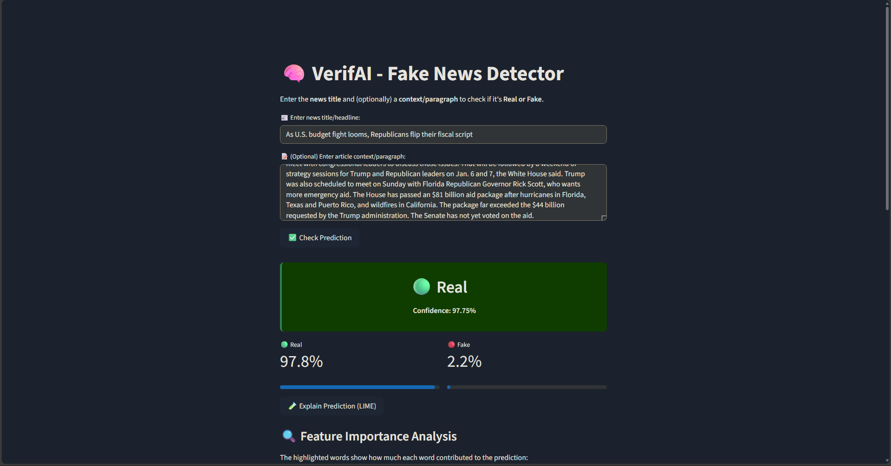
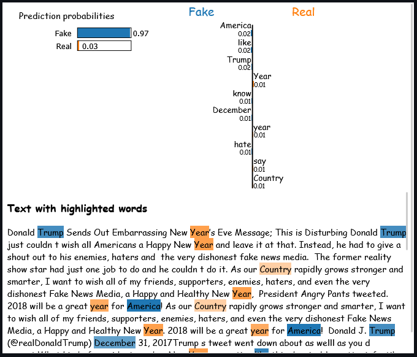

# VerifAI - Fake News Detection

## 🧠 Overview

**VerifAI** is a Fake News Detection system built using Machine Learning and Natural Language Processing (NLP). It allows users to input a news headline and optional context, and determines whether the news is **Real** or **Fake** with high confidence. The system also provides explainability using LIME, helping users understand what influenced the prediction.

## 🚀 Features

-   **Text Input**: Title + optional paragraph context
-   **Prediction**: Real/Fake classification with confidence score
-   **Explainability**: Integrated **LIME** explanations for model decisions
-   **Evaluation Metrics**: Accuracy, Precision, Recall, F1 Score, Confusion Matrix, and ROC-AUC
-   **Streamlit Frontend**: Interactive web app with toggle buttons and progress bars

## 🛠️ Tech Stack

-   **Language**: Python
-   **Frontend**: Streamlit
-   **ML Models**: Logistic Regression, SVM, Random Forest (Voting Classifier)
-   **Vectorization**: TF-IDF
-   **Explainability**: LIME

## 📈 Model Performance

| Metric    | Value  |
| --------- | ------ |
| Accuracy  | 99.18% |
| Precision | 98.99% |
| Recall    | 99.50% |
| F1 Score  | 99.24% |

### Classification Report

```
              precision    recall  f1-score   support

       Fake       0.99      0.99      0.99      3581
       Real       0.99      1.00      0.99      4239

   accuracy                           0.99      7820
  macro avg       0.99      0.99      0.99      7820
weighted avg       0.99      0.99      0.99      7820
```

## 📸 Screenshots

<p float="left">
  
  
</p>

## ⚙️ Installation

### Using UV (Recommended)

1. **Clone the repository**

```bash
git clone https://github.com/Radical-Ghost/VerifAI---Fake-New-Detection
cd VerifAI---Fake-New-Detection
```

2. **Create virtual environment and install dependencies**

```bash
# Create .venv environment
uv venv

# Activate the environment
.venv\Scripts\activate  # Windows
# source .venv/bin/activate  # Linux/Mac

# Install all dependencies from requirements.txt
uv pip install -r requirements.txt
```

3. **Run the app**

```bash
streamlit run verifai_app.py
```

## 🔗 Links

-   [GitHub Repo](https://github.com/Radical-Ghost/VerifAI---Fake-New-Detection)
-   [Streamlit Documentation](https://docs.streamlit.io/)
-   [LIME Documentation](https://github.com/marcotcr/lime)
-   [Dataset Used for Training](https://www.kaggle.com/datasets/emineyetm/fake-news-detection-datasets)

---
